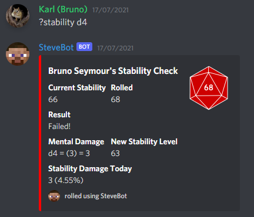
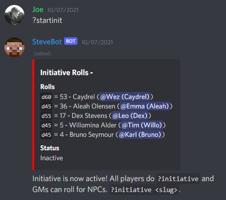
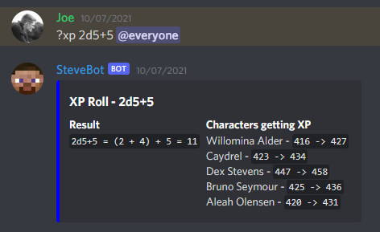
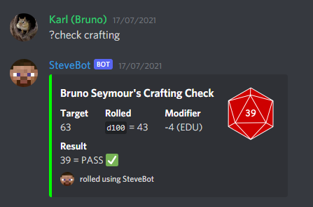

# SteveBot (Discord Bot for Custom Minecraft RPG)
This code is for a discord bot that controls a D&D-esque game within discord.

The game is a custom variation of [Call of Cthulu](https://en.wikipedia.org/wiki/Call_of_Cthulhu_(role-playing_game)). Here are some examples of it in use.

The bot has been configured to be build to a docker image so it can be run in a docker container.

### Stability Checks
Characters have mental stability that has a chance of taking damage when they experience traumatic events.

### Initiative Rolls
When combat begins, all players roll for initiative to decide what order they attack in.

### XP Tracking
As a result of performing some action or winning a fight players can be awarded XP. This is controlled by SteveBot.

### Skill Checks
All players have a list of skills, sometimes in Role Playing players are asked to roll skill checks to see how they perform.

